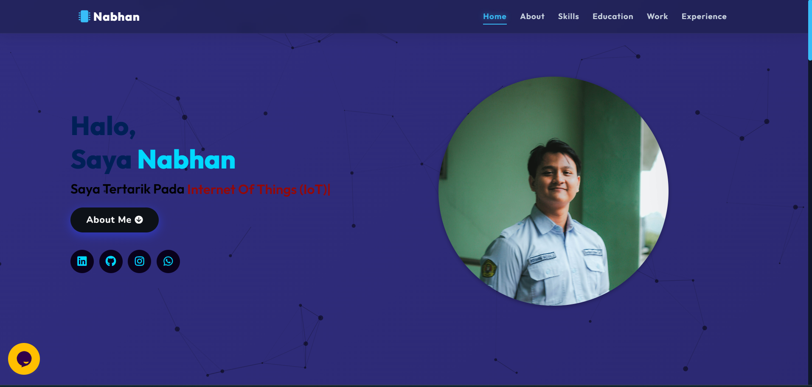

# Muhamad Nabhan's Portfolio Website
Personal portfolio website showcasing my journey as an Electrical Engineering Student & IoT Enthusiast. Built using HTML5, CSS3, JavaScript, and jQuery.

<a href="https://nabhan17-piaxe.github.io/" target="_blank">**Visit My Portfolio** 🚀</a>

## 📌 Tech Stack
&nbsp;
&nbsp;
&nbsp;

### Extras: 
Particle.js, Typed.js, Scroll Reveal, Tawk.to, Font Awesome, and JSON.

## 📌 Sneak Peek of Main Page:

<h2>📬 Contact</h2>

Feel free to reach me through the below handles if you'd like to connect or collaborate!

